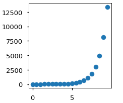
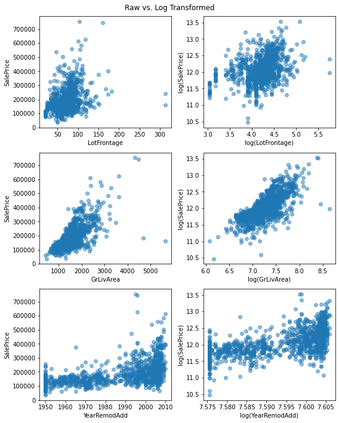

# Log Transformations - Lab

## Introduction

It's time to practice some logarithmic transformations on the Ames Housing dataset!

## Objectives

You will be able to:

- Determine if a log transformation would be useful for a specific model or set of data
- Apply log transformations to independent and dependent variables in linear regression
- Interpret the coefficients of variables that have been transformed using a log transformation

## Ames Housing Data

Below we load the numeric features from the Ames Housing dataset into a dataframe. We also drop any rows with missing data.


```python
import pandas as pd
ames = pd.read_csv("ames.csv", index_col=0)
ames = ames.select_dtypes("number")
ames.dropna(inplace=True)
ames
```


<div>
<style scoped>
    .dataframe tbody tr th:only-of-type {
        vertical-align: middle;
    }

    .dataframe tbody tr th {
        vertical-align: top;
    }

    .dataframe thead th {
        text-align: right;
    }
</style>
<table border="1" class="dataframe">
  <thead>
    <tr style="text-align: right;">
      <th></th>
      <th>MSSubClass</th>
      <th>LotFrontage</th>
      <th>LotArea</th>
      <th>OverallQual</th>
      <th>OverallCond</th>
      <th>YearBuilt</th>
      <th>YearRemodAdd</th>
      <th>MasVnrArea</th>
      <th>BsmtFinSF1</th>
      <th>BsmtFinSF2</th>
      <th>...</th>
      <th>WoodDeckSF</th>
      <th>OpenPorchSF</th>
      <th>EnclosedPorch</th>
      <th>3SsnPorch</th>
      <th>ScreenPorch</th>
      <th>PoolArea</th>
      <th>MiscVal</th>
      <th>MoSold</th>
      <th>YrSold</th>
      <th>SalePrice</th>
    </tr>
    <tr>
      <th>Id</th>
      <th></th>
      <th></th>
      <th></th>
      <th></th>
      <th></th>
      <th></th>
      <th></th>
      <th></th>
      <th></th>
      <th></th>
      <th></th>
      <th></th>
      <th></th>
      <th></th>
      <th></th>
      <th></th>
      <th></th>
      <th></th>
      <th></th>
      <th></th>
      <th></th>
    </tr>
  </thead>
  <tbody>
    <tr>
      <th>1</th>
      <td>60</td>
      <td>65.0</td>
      <td>8450</td>
      <td>7</td>
      <td>5</td>
      <td>2003</td>
      <td>2003</td>
      <td>196.0</td>
      <td>706</td>
      <td>0</td>
      <td>...</td>
      <td>0</td>
      <td>61</td>
      <td>0</td>
      <td>0</td>
      <td>0</td>
      <td>0</td>
      <td>0</td>
      <td>2</td>
      <td>2008</td>
      <td>208500</td>
    </tr>
    <tr>
      <th>2</th>
      <td>20</td>
      <td>80.0</td>
      <td>9600</td>
      <td>6</td>
      <td>8</td>
      <td>1976</td>
      <td>1976</td>
      <td>0.0</td>
      <td>978</td>
      <td>0</td>
      <td>...</td>
      <td>298</td>
      <td>0</td>
      <td>0</td>
      <td>0</td>
      <td>0</td>
      <td>0</td>
      <td>0</td>
      <td>5</td>
      <td>2007</td>
      <td>181500</td>
    </tr>
    <tr>
      <th>3</th>
      <td>60</td>
      <td>68.0</td>
      <td>11250</td>
      <td>7</td>
      <td>5</td>
      <td>2001</td>
      <td>2002</td>
      <td>162.0</td>
      <td>486</td>
      <td>0</td>
      <td>...</td>
      <td>0</td>
      <td>42</td>
      <td>0</td>
      <td>0</td>
      <td>0</td>
      <td>0</td>
      <td>0</td>
      <td>9</td>
      <td>2008</td>
      <td>223500</td>
    </tr>
    <tr>
      <th>4</th>
      <td>70</td>
      <td>60.0</td>
      <td>9550</td>
      <td>7</td>
      <td>5</td>
      <td>1915</td>
      <td>1970</td>
      <td>0.0</td>
      <td>216</td>
      <td>0</td>
      <td>...</td>
      <td>0</td>
      <td>35</td>
      <td>272</td>
      <td>0</td>
      <td>0</td>
      <td>0</td>
      <td>0</td>
      <td>2</td>
      <td>2006</td>
      <td>140000</td>
    </tr>
    <tr>
      <th>5</th>
      <td>60</td>
      <td>84.0</td>
      <td>14260</td>
      <td>8</td>
      <td>5</td>
      <td>2000</td>
      <td>2000</td>
      <td>350.0</td>
      <td>655</td>
      <td>0</td>
      <td>...</td>
      <td>192</td>
      <td>84</td>
      <td>0</td>
      <td>0</td>
      <td>0</td>
      <td>0</td>
      <td>0</td>
      <td>12</td>
      <td>2008</td>
      <td>250000</td>
    </tr>
    <tr>
      <th>...</th>
      <td>...</td>
      <td>...</td>
      <td>...</td>
      <td>...</td>
      <td>...</td>
      <td>...</td>
      <td>...</td>
      <td>...</td>
      <td>...</td>
      <td>...</td>
      <td>...</td>
      <td>...</td>
      <td>...</td>
      <td>...</td>
      <td>...</td>
      <td>...</td>
      <td>...</td>
      <td>...</td>
      <td>...</td>
      <td>...</td>
      <td>...</td>
    </tr>
    <tr>
      <th>1456</th>
      <td>60</td>
      <td>62.0</td>
      <td>7917</td>
      <td>6</td>
      <td>5</td>
      <td>1999</td>
      <td>2000</td>
      <td>0.0</td>
      <td>0</td>
      <td>0</td>
      <td>...</td>
      <td>0</td>
      <td>40</td>
      <td>0</td>
      <td>0</td>
      <td>0</td>
      <td>0</td>
      <td>0</td>
      <td>8</td>
      <td>2007</td>
      <td>175000</td>
    </tr>
    <tr>
      <th>1457</th>
      <td>20</td>
      <td>85.0</td>
      <td>13175</td>
      <td>6</td>
      <td>6</td>
      <td>1978</td>
      <td>1988</td>
      <td>119.0</td>
      <td>790</td>
      <td>163</td>
      <td>...</td>
      <td>349</td>
      <td>0</td>
      <td>0</td>
      <td>0</td>
      <td>0</td>
      <td>0</td>
      <td>0</td>
      <td>2</td>
      <td>2010</td>
      <td>210000</td>
    </tr>
    <tr>
      <th>1458</th>
      <td>70</td>
      <td>66.0</td>
      <td>9042</td>
      <td>7</td>
      <td>9</td>
      <td>1941</td>
      <td>2006</td>
      <td>0.0</td>
      <td>275</td>
      <td>0</td>
      <td>...</td>
      <td>0</td>
      <td>60</td>
      <td>0</td>
      <td>0</td>
      <td>0</td>
      <td>0</td>
      <td>2500</td>
      <td>5</td>
      <td>2010</td>
      <td>266500</td>
    </tr>
    <tr>
      <th>1459</th>
      <td>20</td>
      <td>68.0</td>
      <td>9717</td>
      <td>5</td>
      <td>6</td>
      <td>1950</td>
      <td>1996</td>
      <td>0.0</td>
      <td>49</td>
      <td>1029</td>
      <td>...</td>
      <td>366</td>
      <td>0</td>
      <td>112</td>
      <td>0</td>
      <td>0</td>
      <td>0</td>
      <td>0</td>
      <td>4</td>
      <td>2010</td>
      <td>142125</td>
    </tr>
    <tr>
      <th>1460</th>
      <td>20</td>
      <td>75.0</td>
      <td>9937</td>
      <td>5</td>
      <td>6</td>
      <td>1965</td>
      <td>1965</td>
      <td>0.0</td>
      <td>830</td>
      <td>290</td>
      <td>...</td>
      <td>736</td>
      <td>68</td>
      <td>0</td>
      <td>0</td>
      <td>0</td>
      <td>0</td>
      <td>0</td>
      <td>6</td>
      <td>2008</td>
      <td>147500</td>
    </tr>
  </tbody>
</table>
<p>1121 rows × 37 columns</p>
</div>


## Identify Good Candidates for Log Transformation

Below we plot each of the potential numeric features against `SalePrice`:


```python
import matplotlib.pyplot as plt
import numpy as np

y = ames["SalePrice"]
X = ames.drop("SalePrice", axis=1)

fig, axes = plt.subplots(nrows=6, ncols=6, figsize=(15,15), sharey=True)

for i, column in enumerate(X.columns):
    # Locate applicable axes
    row = i // 6
    col = i % 6
    ax = axes[row][col]
    
    # Plot feature vs. y and label axes
    ax.scatter(X[column], y, alpha=0.2)
    ax.set_xlabel(column)
    if col == 0:
        ax.set_ylabel("SalePrice")

fig.tight_layout()
```


    

    


Let's say we want to build a model with **at least one log-transformed feature** as well as a **log-transformed target**

Do you see any features that look like good candidates for this type of transformation?

For reference, a good candidate for this might look like any of these three graphs:

---

<div align="center"><div style="background-image: url('https://upload.wikimedia.org/wikipedia/commons/thumb/0/00/Population_vs_area.svg/256px-Population_vs_area.svg.png'); height: 200px; width: 256px;"></div><a title="Skbkekas, CC BY-SA 3.0 &lt;http://creativecommons.org/licenses/by-sa/3.0/&gt;, via Wikimedia Commons" href="https://commons.wikimedia.org/wiki/File:Population_vs_area.svg">Skbkekas, CC BY-SA 3.0, via Wikimedia Commons</a></div>

---

<div align="center">
<a href="http://sciences.usca.edu/biology/zelmer/305/trans/">Derek Zelmer, UCSA</a></div>

---



Try to find one feature that resembles each of these shapes.

Because this is real-world messy data, none of them are going to match perfectly, and that's ok!


```python
"""
LotFrontage resembles the first graph, GrLivArea resembles the second one, and
YearRemodAdd resembles the third one. So these are all potential candidates for
log transformation.
"""
```

### Plot Log Transformed Versions of Features

For each feature that you identified as a good candidate for log transformation, plot the feature vs. `SalePrice` as well as the log transformed feature vs. log transformed `SalePrice`.


```python
import numpy as np
candidates = ["LotFrontage", "GrLivArea", "YearRemodAdd"]

fig, axes = plt.subplots(ncols=2, nrows=len(candidates), figsize=(8,10))

for i, column in enumerate(candidates):
    # Plot raw version
    left_ax = axes[i][0]
    left_ax.scatter(ames[column], y, alpha=0.5)
    left_ax.set_xlabel(column)
    left_ax.set_ylabel("SalePrice")
    
    # Plot log transformed version
    right_ax = axes[i][1]
    right_ax.scatter(np.log(ames[column]), np.log(y), alpha=0.5)
    right_ax.set_xlabel(f"log({column})")
    right_ax.set_ylabel("log(SalePrice)")
    
fig.suptitle("Raw vs. Log Transformed")

fig.tight_layout()
```


    

    


Do the transformed relationships look more linear? If so, they should be included in the model.

## Build a Model with Log-Transformed Features and Target

### Data Preparation

Choose up to 3 of the features you investigated, and set up an X dataframe containing the log-transformed versions of these features as well as a y series containing the log-transformed version of the target.

---

<details>
    <summary style="cursor: pointer"><b>Hint (click to reveal)</b></summary>

If you are planning log transform a feature measured in _years_ (e.g. `YearRemodAdd`) consider shifting the data first. For example, you might subtract 1900 or 1910 from the year, so that a 1% increase in year is closer to meaning 1 year rather than 20 years.

</details>


```python
# We are going to use all 3 of the candidates graphed above
X_log = X[candidates].copy()

X_log.describe()
```


<div>
<style scoped>
    .dataframe tbody tr th:only-of-type {
        vertical-align: middle;
    }

    .dataframe tbody tr th {
        vertical-align: top;
    }

    .dataframe thead th {
        text-align: right;
    }
</style>
<table border="1" class="dataframe">
  <thead>
    <tr style="text-align: right;">
      <th></th>
      <th>LotFrontage</th>
      <th>GrLivArea</th>
      <th>YearRemodAdd</th>
    </tr>
  </thead>
  <tbody>
    <tr>
      <th>count</th>
      <td>1121.000000</td>
      <td>1121.000000</td>
      <td>1121.000000</td>
    </tr>
    <tr>
      <th>mean</th>
      <td>70.665477</td>
      <td>1531.411240</td>
      <td>1985.683318</td>
    </tr>
    <tr>
      <th>std</th>
      <td>24.266812</td>
      <td>523.723899</td>
      <td>21.025974</td>
    </tr>
    <tr>
      <th>min</th>
      <td>21.000000</td>
      <td>438.000000</td>
      <td>1950.000000</td>
    </tr>
    <tr>
      <th>25%</th>
      <td>60.000000</td>
      <td>1155.000000</td>
      <td>1966.000000</td>
    </tr>
    <tr>
      <th>50%</th>
      <td>70.000000</td>
      <td>1479.000000</td>
      <td>1995.000000</td>
    </tr>
    <tr>
      <th>75%</th>
      <td>80.000000</td>
      <td>1776.000000</td>
      <td>2005.000000</td>
    </tr>
    <tr>
      <th>max</th>
      <td>313.000000</td>
      <td>5642.000000</td>
      <td>2010.000000</td>
    </tr>
  </tbody>
</table>
</div>


```python

# However YearRemodAdd is tricky. A 1% increase in the year means
# roughly a 20-year increase for 20th-21st century dates

# That would result in a very large, difficult-to-interpret coefficient

# Based on the .describe() call above, we see that the latest remodel
# year was 2010

# So let's try subtracting 1910 from YearRemodAdd. So now a 0 means 1910
# and 1 year = 1% increase
X_log["YearRemodAdd"] = X_log["YearRemodAdd"] - 1910
X_log.describe()
```


<div>
<style scoped>
    .dataframe tbody tr th:only-of-type {
        vertical-align: middle;
    }

    .dataframe tbody tr th {
        vertical-align: top;
    }

    .dataframe thead th {
        text-align: right;
    }
</style>
<table border="1" class="dataframe">
  <thead>
    <tr style="text-align: right;">
      <th></th>
      <th>LotFrontage</th>
      <th>GrLivArea</th>
      <th>YearRemodAdd</th>
    </tr>
  </thead>
  <tbody>
    <tr>
      <th>count</th>
      <td>1121.000000</td>
      <td>1121.000000</td>
      <td>1121.000000</td>
    </tr>
    <tr>
      <th>mean</th>
      <td>70.665477</td>
      <td>1531.411240</td>
      <td>75.683318</td>
    </tr>
    <tr>
      <th>std</th>
      <td>24.266812</td>
      <td>523.723899</td>
      <td>21.025974</td>
    </tr>
    <tr>
      <th>min</th>
      <td>21.000000</td>
      <td>438.000000</td>
      <td>40.000000</td>
    </tr>
    <tr>
      <th>25%</th>
      <td>60.000000</td>
      <td>1155.000000</td>
      <td>56.000000</td>
    </tr>
    <tr>
      <th>50%</th>
      <td>70.000000</td>
      <td>1479.000000</td>
      <td>85.000000</td>
    </tr>
    <tr>
      <th>75%</th>
      <td>80.000000</td>
      <td>1776.000000</td>
      <td>95.000000</td>
    </tr>
    <tr>
      <th>max</th>
      <td>313.000000</td>
      <td>5642.000000</td>
      <td>100.000000</td>
    </tr>
  </tbody>
</table>
</div>


```python
# Go through and log transform all columns
for column in X_log.columns:
    X_log[f"log_{column}"] = np.log(X_log[column])
    X_log.drop(column, axis=1, inplace=True)
    
X_log
```


<div>
<style scoped>
    .dataframe tbody tr th:only-of-type {
        vertical-align: middle;
    }

    .dataframe tbody tr th {
        vertical-align: top;
    }

    .dataframe thead th {
        text-align: right;
    }
</style>
<table border="1" class="dataframe">
  <thead>
    <tr style="text-align: right;">
      <th></th>
      <th>log_LotFrontage</th>
      <th>log_GrLivArea</th>
      <th>log_YearRemodAdd</th>
    </tr>
    <tr>
      <th>Id</th>
      <th></th>
      <th></th>
      <th></th>
    </tr>
  </thead>
  <tbody>
    <tr>
      <th>1</th>
      <td>4.174387</td>
      <td>7.444249</td>
      <td>4.532599</td>
    </tr>
    <tr>
      <th>2</th>
      <td>4.382027</td>
      <td>7.140453</td>
      <td>4.189655</td>
    </tr>
    <tr>
      <th>3</th>
      <td>4.219508</td>
      <td>7.487734</td>
      <td>4.521789</td>
    </tr>
    <tr>
      <th>4</th>
      <td>4.094345</td>
      <td>7.448334</td>
      <td>4.094345</td>
    </tr>
    <tr>
      <th>5</th>
      <td>4.430817</td>
      <td>7.695303</td>
      <td>4.499810</td>
    </tr>
    <tr>
      <th>...</th>
      <td>...</td>
      <td>...</td>
      <td>...</td>
    </tr>
    <tr>
      <th>1456</th>
      <td>4.127134</td>
      <td>7.406711</td>
      <td>4.499810</td>
    </tr>
    <tr>
      <th>1457</th>
      <td>4.442651</td>
      <td>7.636752</td>
      <td>4.356709</td>
    </tr>
    <tr>
      <th>1458</th>
      <td>4.189655</td>
      <td>7.757906</td>
      <td>4.564348</td>
    </tr>
    <tr>
      <th>1459</th>
      <td>4.219508</td>
      <td>6.982863</td>
      <td>4.454347</td>
    </tr>
    <tr>
      <th>1460</th>
      <td>4.317488</td>
      <td>7.135687</td>
      <td>4.007333</td>
    </tr>
  </tbody>
</table>
<p>1121 rows × 3 columns</p>
</div>


```python
y_log = np.log(y)
y_log.name = "log_SalePrice"
y_log
```


    Id
    1       12.247694
    2       12.109011
    3       12.317167
    4       11.849398
    5       12.429216
              ...    
    1456    12.072541
    1457    12.254863
    1458    12.493130
    1459    11.864462
    1460    11.901583
    Name: log_SalePrice, Length: 1121, dtype: float64


### Modeling

Now build a StatsModels OLS model with a log-transformed target as well as log-transformed features.


```python
import statsmodels.api as sm

model = sm.OLS(y_log, sm.add_constant(X_log))
results = model.fit()
```

### Model Evaluation and Interpretation

How did the model perform? How might we interpret its coefficients? Create as many cells as needed.


```python
print(results.summary())
```

                                OLS Regression Results                            
    ==============================================================================
    Dep. Variable:          log_SalePrice   R-squared:                       0.688
    Model:                            OLS   Adj. R-squared:                  0.687
    Method:                 Least Squares   F-statistic:                     820.6
    Date:                Mon, 13 Jun 2022   Prob (F-statistic):          8.34e-282
    Time:                        12:10:13   Log-Likelihood:                 98.731
    No. Observations:                1121   AIC:                            -189.5
    Df Residuals:                    1117   BIC:                            -169.4
    Df Model:                           3                                         
    Covariance Type:            nonrobust                                         
    ====================================================================================
                           coef    std err          t      P>|t|      [0.025      0.975]
    ------------------------------------------------------------------------------------
    const                4.2715      0.160     26.740      0.000       3.958       4.585
    log_LotFrontage      0.1755      0.020      8.651      0.000       0.136       0.215
    log_GrLivArea        0.6705      0.023     29.320      0.000       0.626       0.715
    log_YearRemodAdd     0.5041      0.022     23.014      0.000       0.461       0.547
    ==============================================================================
    Omnibus:                      124.227   Durbin-Watson:                   2.076
    Prob(Omnibus):                  0.000   Jarque-Bera (JB):              380.156
    Skew:                          -0.549   Prob(JB):                     2.82e-83
    Kurtosis:                       5.633   Cond. No.                         230.
    ==============================================================================
    
    Notes:
    [1] Standard Errors assume that the covariance matrix of the errors is correctly specified.


```python
# Just for demonstration purposes, to show that we can use the % approximation
# because the betas are small enough:
for column in results.params.index[1:]:
    print(f"""
    {column}
    Approximation:      {results.params[column]}
    More precise value: {(np.exp(results.params[column] * np.log(1.01)) - 1) * 100}
    """)
```

    
        log_LotFrontage
        Approximation:      0.17553002535033485
        More precise value: 0.17481079893331142
        
    
        log_GrLivArea
        Approximation:      0.6704791556946889
        More precise value: 0.6693793387537061
        
    
        log_YearRemodAdd
        Approximation:      0.5040970917054829
        More precise value: 0.5028533695270898
        


```python
"""
The model explained about 69% of the variance in SalePrice

All coefficients were statistically significant

For each increase of 1% in lot frontage, we see an associated increase
of about 0.2% in sale price

For each increase of 1% in above-grade living area, we see an associated
increase of about 0.7% in sale price

For each increase of 1 year since 1910 in remodel year, we see an
associated increase of about 0.5% in sale price
"""
```

## Summary

Now you have practiced modeling with log transformations! This is a subtle, messy process, so don't be discouraged if this was a tricky lab.
